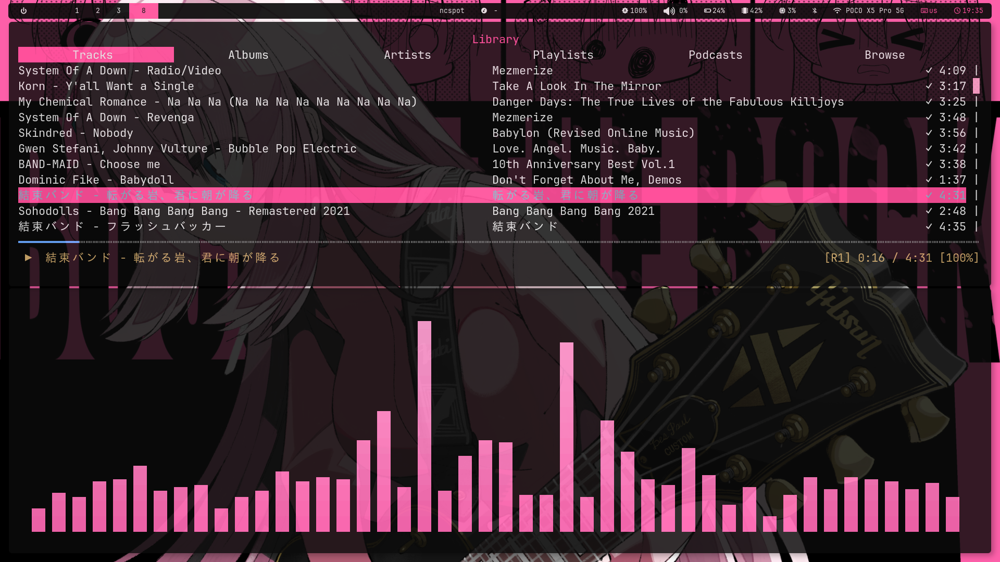
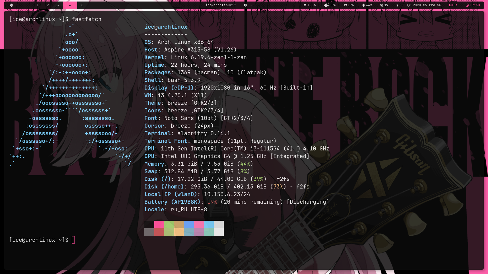

# MY FIRST TIME (rice) (≧◡≦)
# Be gentle please (,,>﹏<,,)


This rice is inspired by **Bocchi the Rock!**

Minimal Arch Linux setup using **i3 window manager**.

---

## Features

- i3 window manager
- Polybar status bar
- Rofi launcher
- Picom compositor
- Dunst notifications
- Alacritty terminal
- Custom lockscreen
- Cute dark theme (￣▽￣)

---
## Screenshots 




## Installation

Clone the repository and run the setup script.

```bash
git clone https://github.com/ExelIce/arch-i3-rice
cd arch-i3-rice
chmod +x setup.sh
./setup.sh
```
---

## 💗 Final words

Enjoy using this rice!  

And don't forget to watch **Bocchi the Rock!** (≧◡≦)  

Have fun customizing your system (￣▽￣)  
